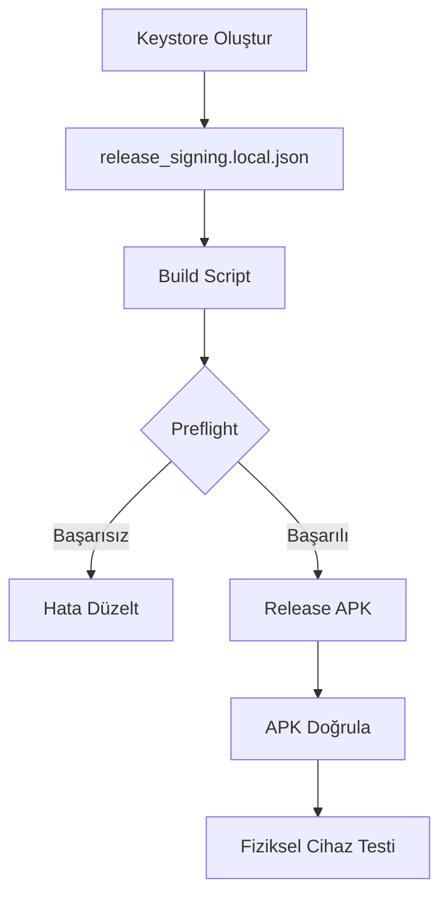

# Android Release Checklist

> **Proje:** MMAE — Bandırma Yolculuğu (Godot 4.6.2)
> **Son Güncelleme:** 2026-05-15

---

## Release Build Pipeline Durumu

| Kontrol Noktası | Durum | Detay |
|-----------------|-------|-------|
| Export Preset | ✅ | `export_presets.cfg`'de "Android" preset tanımlı |
| Package Name | ✅ | `com.mmae.bandirmayolculugu` |
| Version | ✅ | `1.0.0` (code=1) |
| Min SDK | ✅ | 21 |
| Target SDK | ✅ | 34 |
| Orientation | ✅ | Portrait |
| Architecture | ✅ | arm64, arm32, x86_64 |
| Build Script | ✅ | `tools/build_android_release_candidate.ps1` mevcut |
| Debug APK | ✅ | `builds/BandirmaYolculugu_debug.apk` (151 MB) |

---

## Blocker 1: Keystore & Release Signing

| Öğe | Durum | Yapılması Gereken |
|-----|-------|-------------------|
| Keystore dosyası | ❌ **Eksik** | `keytool` ile `builds/release.keystore` oluşturulmalı |
| `keystore/release` | ❌ **Boş** | Keystore dosya yolu girilmeli (Godot Editor > Export > Keystore) |
| `keystore/release_user` | ❌ **Boş** | Alias (`bandirma`) girilmeli |
| `keystore/release_password` | ❌ **Boş** | Keystore şifresi girilmeli (cfg'ye yazma, Editor'dan gir) |
| `release_signing.local.json` | ❌ **Eksik** | `artifacts/local/release_signing/` altında oluşturulmalı |
| `.gitignore` (artifacts/local/) | ❌ **Kontrol edilmeli** | `artifacts/local/` gitignore'da olmalı |

> 📖 **Detaylı talimat:** [`docs/KEYSTORE_SETUP.md`](docs/KEYSTORE_SETUP.md)

---

## Build Script Analizi: `tools/build_android_release_candidate.ps1`

### Mevcut Özellikler ✅

| Özellik | Durum | Açıklama |
|---------|-------|----------|
| Doğru preset kullanımı | ✅ | `$PresetName` varsayılan "Android" |
| Keystore preflight kontrolü | ✅ | `keystore/release` ve `keystore/release_user` boşsa bloklar |
| Local signing config desteği | ✅ | `artifacts/local/release_signing/release_signing.local.json` dosyasını okur |
| Geçici cfg yazma/geri yükleme | ✅ | Keystore bilgilerini geçici cfg'ye yazar, build sonrası geri yükler |
| Checklist güncelleme | ✅ | `P12_RELEASE_BUILD_STATUS` marker'ını günceller |
| Version mismatch kontrolü | ✅ | `project.godot` vs `export_presets.cfg` version uyumu |
| Timestamp'li output | ✅ | `BandirmaYolculugu_release_yyyyMMdd_HHmmss.apk` formatı |

### Eksikler / İyileştirme Önerileri ⚠️

| Eksik | Etki | Öneri |
|-------|------|-------|
| `keystore/release_password` preflight kontrolü yok | Düşük | Şifre eksik olsa bile build başarısız olur (jarsigner hatası). Yine de erken uyarı eklenebilir |
| `release_signing.local.json` yoksa hata mesajı net değil | Düşük | Preflight'a "local signing config dosyası bulunamadı" uyarısı eklenebilir |
| Version code otomatik artırma yok | Orta | Her release'de version/code manuel artırılmalı |
| Godot yolu varsayılanı farklı dizine bakıyor | Düşük | `C:\Users\Aykut\Desktop\MM-AE-main\` yolu proje kökü değil. `$env:GODOT_EXE` ile override edilebilir |

### Çalıştırılabilirlik Durumu

Script şu an **çalıştırılabilir** ancak keystore olmadan preflight'ta bloklanır ve şu hatayı verir:

```
[BUILD] RELEASE_PREFLIGHT_BLOCKED
[BUILD] - Release signing hazir degil: keystore/release ve keystore/release_user yerel olarak tanimlanmali.
```

---

## Release Build İçin Sıralı Adımlar



### Adım 1: Keystore Oluştur
```powershell
keytool -genkey -v -keystore "builds/release.keystore" -alias bandirma -keyalg RSA -keysize 2048 -validity 10000
```
📖 Detay: [`docs/KEYSTORE_SETUP.md`](docs/KEYSTORE_SETUP.md#2-keystore-oluşturma)

### Adım 2: Local Signing Config
```powershell
New-Item -ItemType Directory -Path "artifacts/local/release_signing" -Force | Out-Null
@{
    keystore_path = "C:\Users\Aykut\Documents\Godot\mmae\builds\release.keystore"
    keystore_user = "bandirma"
    keystore_password = "OLUSTURDUGUN_SIFRE"
} | ConvertTo-Json | Out-File -FilePath "artifacts/local/release_signing/release_signing.local.json" -Encoding utf8
```

### Adım 3: Release APK Build
```powershell
.\tools\build_android_release_candidate.ps1
```

### Adım 4: APK Doğrulama
```powershell
# APK imza detaylarını görüntüle
keytool -list -v -keystore "builds\release.keystore"
```

---

## Geçmiş Build'ler

| Tarih | Tür | Dosya | Boyut |
|-------|-----|-------|-------|
| 2026-05-14 | Release (imzasız) | `builds/BandirmaYolculugu_release_20260514_203155.apk` | 154 MB |
| 2026-05-11 | Debug | `builds/BandirmaYolculugu_debug.apk` | 151 MB |

---

## P12_RELEASE_BUILD_STATUS Marker

Bu marker, `build_android_release_candidate.ps1` script'i tarafından otomatik güncellenir:

| Değer | Anlamı |
|-------|--------|
| `BUILD_RELEASE_OK` | Release APK başarıyla oluşturuldu |
| `BUILD_RELEASE_FAILED` | Build başarısız oldu |
| `BUILD_RELEASE_BLOCKED` | Preflight kontrollerinden biri başarısız |
| `BUILD_RELEASE_NOT_ATTEMPTED` | Henüz build denenmedi (başlangıç durumu) |

**Mevcut durum:** `BUILD_RELEASE_NOT_ATTEMPTED`
